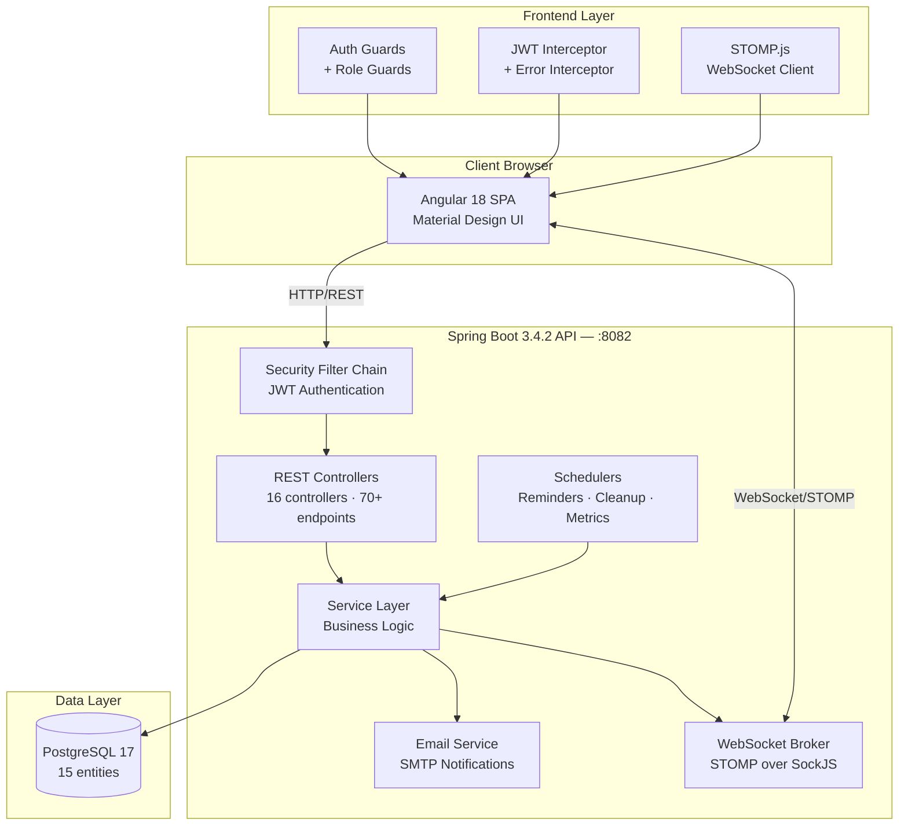
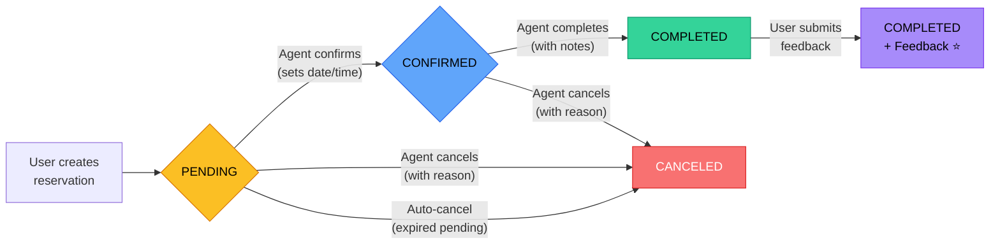
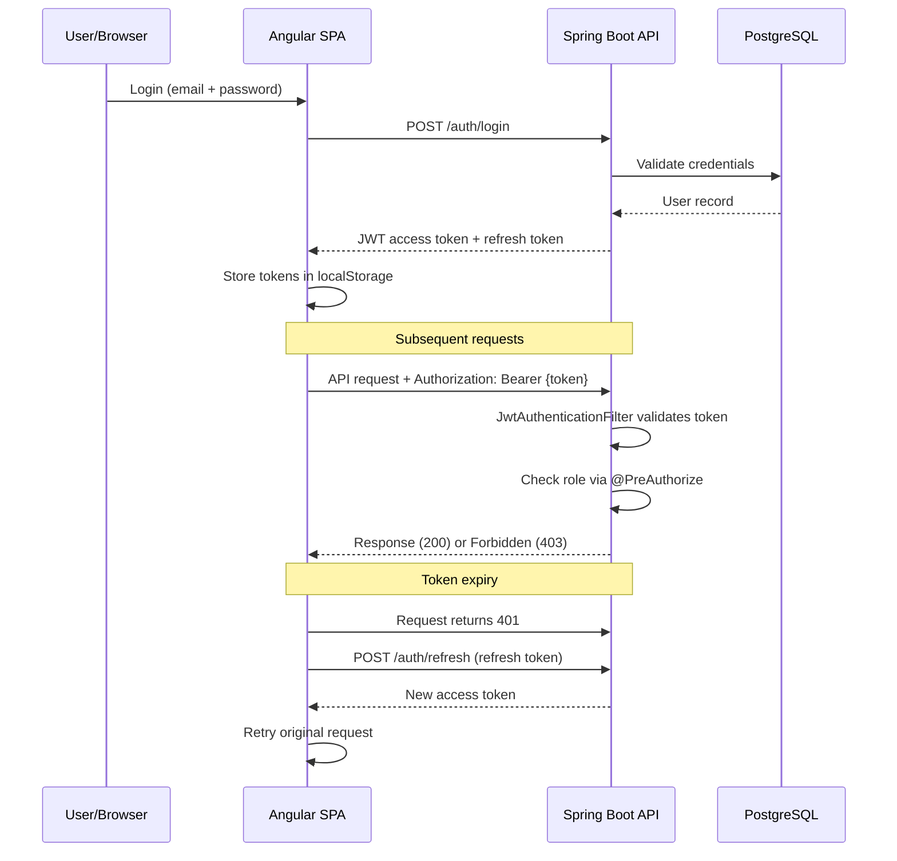

<div align="center">

# AgencyBooking Platform

**A full-stack agency reservation management system with real-time collaboration**


</div>

---

## Overview

AgencyBooking is a multi-role platform that connects **users** seeking services with **agencies** and their **agents**. Users browse agencies, book appointments for specific services, and track their reservations. Agents manage incoming bookings with a real-time locking system that prevents conflicts. Administrators oversee the entire ecosystem — managing users, agents, agencies, services, and platform statistics.

The system features real-time WebSocket communication for reservation locking, email notifications for booking lifecycle events, and a role-based security model with JWT authentication.

<video src="record.mp4" controls width="600"></video>
---

## Architecture



---

## Reservation Lifecycle



**Locking system:** When an agent opens a pending reservation, a 5-minute lock is acquired via WebSocket. Other agents see the lock in real time and cannot modify it until the lock expires or is released.

---

## Features

### Public
- Browse agencies and services catalog
- View agency details, business hours, and available agents
- Landing page with platform statistics and testimonials
- Contact form for support inquiries

### User (Authenticated)
- Book appointments by selecting an agency, service, date, and time slot
- Real-time availability checking with time slot picker
- View and track reservation history with status badges
- Submit feedback and ratings for completed reservations
- Profile management (username, password, account deletion)
- Email notifications for booking confirmations, cancellations, and reminders

### Agent
- Dashboard with reservation statistics and activity overview
- Manage pending reservations — confirm (set date/time), cancel (with reason), or complete (with notes)
- Real-time reservation locking to prevent agent conflicts
- Calendar view of upcoming confirmed appointments
- Block/unblock time slots for unavailability
- Toggle personal availability status
- Profile management

### Admin
- Platform overview dashboard with key metrics
- Full CRUD for users, agents, agencies, and services
- Assign/remove agents to/from agencies
- Change user roles (User → Agent → Admin)
- View contact messages with read/unread management
- Platform-wide statistics with session graphs
- Monitor scheduled tasks health
- Profile management

---

## Tech Stack

| Layer | Technology | Version |
|-------|-----------|---------|
| **Frontend** | Angular (Standalone Components) | 18.2 |
| **UI Library** | Angular Material | 18.2 |
| **WebSocket Client** | STOMP.js + SockJS | 7.3 |
| **Reactive** | RxJS | 7.8 |
| **Backend** | Spring Boot | 3.4.2 |
| **Language** | Java | 21 |
| **Security** | Spring Security + JWT (jjwt) | 0.11.5 |
| **WebSocket** | Spring WebSocket + STOMP | — |
| **Database** | PostgreSQL | 17 |
| **ORM** | Hibernate / Spring Data JPA | — |
| **Email** | Spring Mail (SMTP) | — |
| **API Docs** | SpringDoc OpenAPI (Swagger) | 2.3.0 |
| **Build (BE)** | Maven Wrapper | 3.9.9 |
| **Build (FE)** | Angular CLI | 18.2 |
| **Containerization** | Docker + Docker Compose | — |

---

## Project Structure

```
PFE/
├── agency-booking-frontend/          # Angular 18 SPA
│   ├── src/
│   │   ├── app/
│   │   │   ├── core/                 # Auth, interceptors, services
│   │   │   │   ├── auth/            # Guards, JWT interceptor
│   │   │   │   └── services/        # Auth, WebSocket, Notification, Storage, Sidebar
│   │   │   ├── features/            # Lazy-loaded feature modules
│   │   │   │   ├── admin/           # Admin dashboard & management
│   │   │   │   ├── agent/           # Agent reservation management
│   │   │   │   ├── auth/            # Login, register, password reset
│   │   │   │   ├── landing/         # Public landing page
│   │   │   │   └── user/            # User bookings & profile
│   │   │   └── shared/              # Reusable components, models, pipes
│   │   ├── environments/            # Dev & prod configs
│   │   └── styles.scss              # Design system & tokens
│   ├── angular.json
│   └── package.json
│
├── agent_final/                      # Spring Boot 3.4.2 API
│   ├── src/main/java/com/project/agent/
│   │   ├── configuration/           # WebSocket, OpenAPI, scheduling
│   │   ├── controller/              # 16 REST controllers
│   │   ├── dto/                     # Request/response DTOs
│   │   ├── exception/               # Global handler + custom exceptions
│   │   ├── model/                   # 15 JPA entities
│   │   ├── repository/              # Spring Data repositories
│   │   ├── scheduler/               # Cron jobs (reminders, cleanup)
│   │   ├── security/                # JWT provider, filters, config
│   │   └── service/                 # Business logic layer
│   ├── src/main/resources/
│   │   ├── application.properties
│   │   ├── application-docker.properties
│   │   └── application-prod.properties
│   ├── docker-compose.yml
│   ├── Dockerfile
│   └── pom.xml
│
└── commands.txt                      # Quick-start reference
```

---

## Installation Guide

### Prerequisites

| Tool | Version | Check |
|------|---------|-------|
| Node.js | 18+ | `node -v` |
| npm | 9+ | `npm -v` |
| Java JDK | 21 | `java -version` |
| Docker & Docker Compose | Latest | `docker --version` |
| Git | Latest | `git --version` |

### 1. Clone the Repository

```bash
git clone <repository-url>
cd PFE
```

### 2. Start PostgreSQL

```bash
docker compose -f agent_final/docker-compose.yml up db -d
```

This starts PostgreSQL 17 on port `5432` with database `Project`.

### 3. Configure Environment Variables

Create or export the following variables before running the backend:

| Variable | Description | Default |
|----------|-------------|---------|
| `JWT_SECRET` | HMAC-SHA256 signing key (64+ hex chars) | Built-in dev key |
| `MAIL_PASSWORD` | SMTP app password for email notifications | — |
| `CORS_ALLOWED_ORIGINS` | Comma-separated allowed origins | `http://localhost:4200` |
| `FRONTEND_URL` | Frontend base URL for email links | `http://localhost:4200` |

```bash
export JWT_SECRET="your-64-char-hex-secret-key-here"
export MAIL_PASSWORD="your-smtp-app-password"
```

### 4. Run the Backend

```bash
cd agent_final
./mvnw clean compile
./mvnw spring-boot:run
```

The API starts on **http://localhost:8082**.

### 5. Run the Frontend

```bash
cd agency-booking-frontend
npm install
npm start
```

The app starts on **http://localhost:4200**.

### 6. Access the Application

| URL | Description |
|-----|-------------|
| http://localhost:4200 | Frontend application |
| http://localhost:8082 | Backend API |
| http://localhost:8082/swagger-ui.html | Swagger API documentation |
| http://localhost:8082/v3/api-docs | OpenAPI JSON spec |

### 7. First User Setup

1. Navigate to http://localhost:4200/auth/register
2. Register a new account (email verification required)
3. Check your email for the verification code
4. To create an admin, update the user's role directly in the database:
   ```sql
   UPDATE users SET role = 'ADMIN' WHERE email = 'your@email.com';
   ```
5. Subsequent role changes can be done from the admin dashboard

---

## API Overview

All endpoints are prefixed with the backend base URL (`http://localhost:8082`).

| Domain | Base Path | Auth | Description |
|--------|-----------|------|-------------|
| **Auth** | `/auth` | Public | Login, register, token refresh, password reset |
| **Public** | `/api/public/*` | Public | Statistics, feedback, testimonials |
| **Agencies** | `/api/agencies` | Public (read) / Admin (write) | Agency CRUD, agent assignment |
| **Services** | `/api/services` | Public (read) / Admin (write) | Service offering management |
| **Availability** | `/api/availability` | Public | Time slots, weekly availability |
| **User** | `/api/user` | USER+ | Profile, reservations, stats |
| **Feedback** | `/api/feedback` | USER+ | Submit and view reservation feedback |
| **Contact** | `/api/contact` | USER+ | Submit support messages |
| **Agent** | `/api/agent` | AGENT | Reservation management, stats, lock system |
| **Time Slots** | `/api/timeslots` | AGENT/ADMIN | Block/unblock time slots |
| **Admin** | `/api/admin` | ADMIN | User/agent management, statistics, contacts |
| **Monitoring** | `/api/admin/monitoring` | ADMIN | Scheduled tasks health |

Full interactive documentation available at **Swagger UI**: http://localhost:8082/swagger-ui.html

---

## Real-Time Features

The platform uses **WebSocket with STOMP protocol** over SockJS for real-time communication.

| Topic | Direction | Purpose |
|-------|-----------|---------|
| `/topic/reservation-lock-status` | Server → All agents | Broadcast when any reservation is locked/unlocked |
| `/topic/lock-status/{id}` | Server → Subscribers | Lock status updates for a specific reservation |
| `/app/check-lock/{id}` | Client → Server | Request current lock status for a reservation |

**Connection:** Clients connect to `/websocket` or `/reservation-websocket` endpoints with JWT token in headers. Heartbeat interval is 10 seconds.

---

## Security Model



**Roles & Access:**

| Role | Access Level |
|------|-------------|
| `USER` | Book reservations, view own data, submit feedback |
| `AGENT` | Manage reservations for assigned agency, lock system |
| `ADMIN` | Full platform management, all USER + AGENT permissions |

**Frontend Guards:**
- `authGuard` — Requires authentication
- `roleGuard(role)` — Requires specific role (ADMIN bypasses)
- `guestGuard` — Blocks authenticated users from auth pages

---

## Environment Variables

| Variable | Required | Default | Description |
|----------|----------|---------|-------------|
| `JWT_SECRET` | Yes (prod) | Dev key provided | HMAC-SHA256 secret for signing tokens |
| `MAIL_PASSWORD` | Yes | — | SMTP app password for Gmail |
| `CORS_ALLOWED_ORIGINS` | No | `http://localhost:4200` | Allowed CORS origins |
| `FRONTEND_URL` | No | `http://localhost:4200` | Base URL for email links |
| `SPRING_DATASOURCE_URL` | No | `jdbc:postgresql://localhost:5432/Project` | Database connection URL |
| `SPRING_DATASOURCE_USERNAME` | No | `postgres` | Database username |
| `SPRING_DATASOURCE_PASSWORD` | No | — | Database password |

---

## Docker Deployment

### Full Stack with Docker Compose

```bash
cd agent_final
docker compose up --build
```

This starts:
- **PostgreSQL 17** on port 5432 (with persistent volume)
- **Spring Boot API** on port 8082

The backend uses a multi-stage Docker build (Maven build → JRE runtime) with the `docker` Spring profile.

### Frontend Build

```bash
cd agency-booking-frontend
npm run build
# Serve dist/ with nginx or any static file server
```

---

## Screenshots

> Screenshots coming soon — the platform features a modern glassmorphism design with a warm indigo/violet color palette.

---

## Further Documentation

| Document | Description |
|----------|-------------|
| [Frontend README](./agency-booking-frontend/README.md) | Angular app architecture, components, design system |
| [Backend README](./agent_final/README.md) | Spring Boot API, entities, endpoints, security details |
| [Swagger UI](http://localhost:8082/swagger-ui.html) | Interactive API documentation (when running) |
