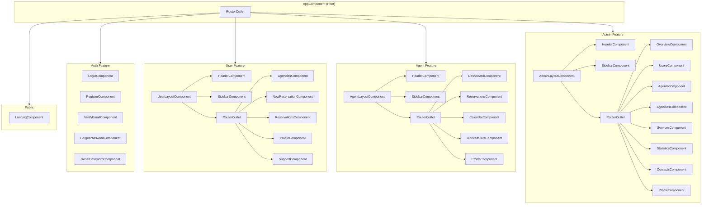
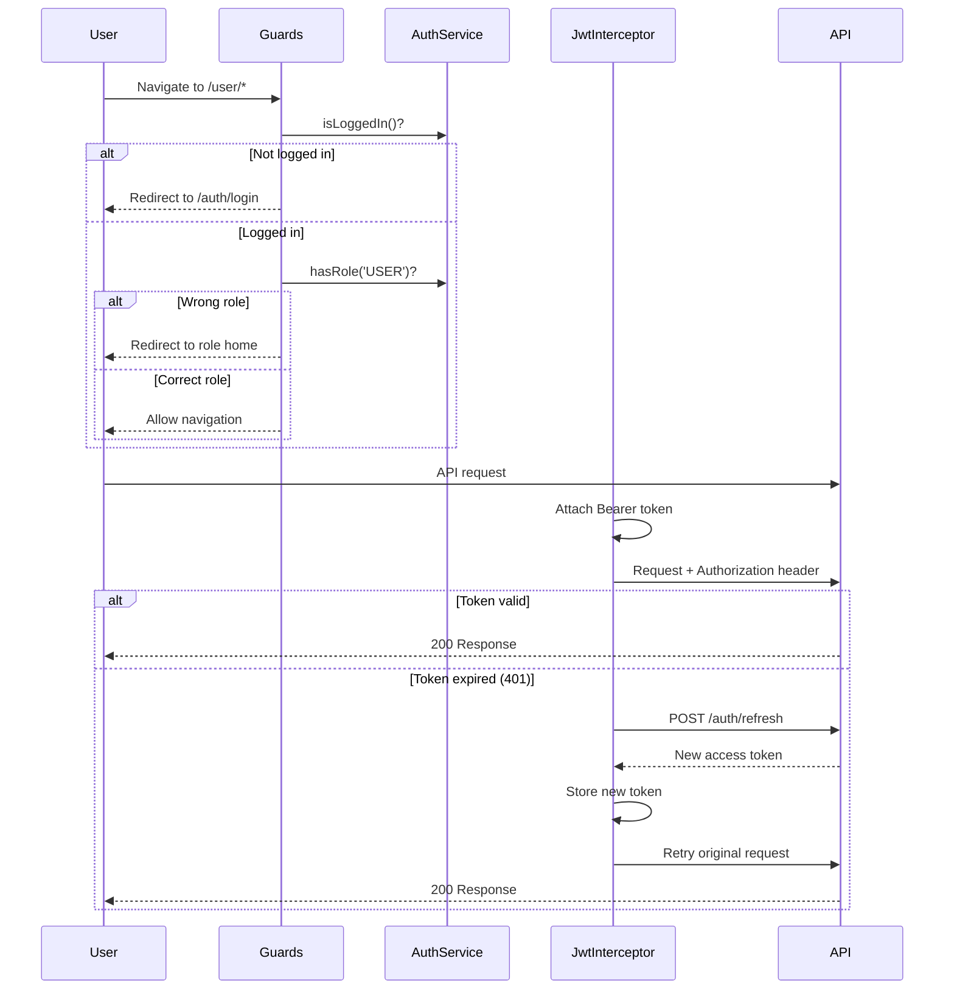

<div align="center">

# AgencyBooking — Frontend

**Modern Angular 18 SPA with Material Design, real-time WebSocket, and role-based dashboards**


</div>

---

## Overview

The frontend is a single-page application built with **Angular 18** using the modern standalone component architecture. It provides three role-based dashboards (User, Agent, Admin), real-time reservation locking via WebSocket, and a polished glassmorphism design system built on Angular Material.

---

## Tech Stack

| Technology | Version | Purpose |
|-----------|---------|---------|
| Angular | 18.2.0 | Core framework (standalone components) |
| Angular Material | 18.2.14 | UI component library |
| Angular CDK | 18.2.14 | Component Dev Kit |
| TypeScript | 5.5.2 | Language |
| RxJS | 7.8.0 | Reactive state & async operations |
| STOMP.js | 7.3.0 | WebSocket STOMP protocol client |
| SockJS | 1.6.1 | WebSocket fallback transport |
| Zone.js | 0.14.10 | Change detection |
| Angular CLI | 18.2.21 | Build tooling |

---

## Architecture



---

## Project Structure

```
src/
├── app/
│   ├── core/                          # Singleton services & auth infrastructure
│   │   ├── auth/
│   │   │   ├── auth.guard.ts          # authGuard, roleGuard, guestGuard
│   │   │   ├── auth.service.ts        # Login, register, token management
│   │   │   └── jwt.interceptor.ts     # Adds Bearer token, handles 401 refresh
│   │   ├── interceptors/
│   │   │   └── error.interceptor.ts   # Global HTTP error handler
│   │   └── services/
│   │       ├── auth.service.ts        # Authentication state & API calls
│   │       ├── storage.service.ts     # LocalStorage abstraction for tokens
│   │       ├── notification.service.ts # Material Snackbar notifications
│   │       ├── sidebar.service.ts     # Sidebar toggle state (signals)
│   │       └── websocket.service.ts   # STOMP WebSocket client
│   │
│   ├── features/                      # Lazy-loaded feature areas
│   │   ├── admin/                     # Admin dashboard (9 routes)
│   │   │   ├── admin-layout.component.ts
│   │   │   ├── admin.routes.ts
│   │   │   ├── overview/             # Platform metrics dashboard
│   │   │   ├── users/                # User management (CRUD, role changes)
│   │   │   ├── agents/               # Agent management & assignment
│   │   │   ├── agencies/             # Agency CRUD with business hours
│   │   │   ├── services/             # Service offering management
│   │   │   ├── statistics/           # Session graphs, system stats
│   │   │   ├── contacts/             # Support message management
│   │   │   └── profile/              # Admin profile settings
│   │   │
│   │   ├── agent/                     # Agent workspace (6 routes)
│   │   │   ├── agent-layout.component.ts
│   │   │   ├── agent.routes.ts
│   │   │   ├── dashboard/            # Stats overview & recent activity
│   │   │   ├── reservations/         # Reservation management with lock system
│   │   │   │   ├── reservations.component.ts
│   │   │   │   ├── confirm-dialog/   # Set date/time for confirmation
│   │   │   │   ├── cancel-dialog/    # Cancel with reason
│   │   │   │   └── complete-dialog/  # Complete with notes
│   │   │   ├── calendar/             # Upcoming appointments calendar
│   │   │   ├── blocked-slots/        # Block/unblock time slots
│   │   │   └── profile/              # Agent profile settings
│   │   │
│   │   ├── user/                      # User area (6 routes)
│   │   │   ├── user-layout.component.ts
│   │   │   ├── user.routes.ts
│   │   │   ├── agencies/             # Browse & select agencies
│   │   │   ├── new-reservation/      # Booking flow with time slot picker
│   │   │   ├── reservations/         # Reservation history & feedback
│   │   │   ├── profile/              # User profile settings
│   │   │   └── support/              # Contact form
│   │   │
│   │   ├── auth/                      # Authentication (5 routes)
│   │   │   ├── auth.routes.ts
│   │   │   ├── login/
│   │   │   ├── register/
│   │   │   ├── verify-email/
│   │   │   ├── forgot-password/
│   │   │   └── reset-password/
│   │   │
│   │   └── landing/                   # Public landing page
│   │       └── landing.component.ts
│   │
│   ├── shared/                        # Reusable across features
│   │   ├── animations/
│   │   │   ├── index.ts              # Animation exports
│   │   │   └── route.animations.ts   # Page transition animations
│   │   ├── components/
│   │   │   ├── header/               # Fixed top navbar
│   │   │   ├── sidebar/              # Collapsible navigation sidebar
│   │   │   ├── custom-snackbar/      # Typed toast notifications
│   │   │   ├── confirm-dialog/       # Reusable confirmation modal
│   │   │   ├── loading-spinner/      # Animated dot spinner
│   │   │   └── status-badge/         # Reservation status indicator
│   │   ├── models/                    # TypeScript interfaces & types
│   │   │   ├── index.ts              # Barrel exports
│   │   │   ├── user.model.ts
│   │   │   ├── agency.model.ts
│   │   │   ├── reservation.model.ts
│   │   │   ├── agent.model.ts
│   │   │   ├── availability.model.ts
│   │   │   ├── contact.model.ts
│   │   │   ├── stats.model.ts
│   │   │   └── api-response.model.ts
│   │   └── pipes/
│   │       └── date-fr.pipe.ts       # French date formatting
│   │
│   ├── app.component.ts              # Root component
│   ├── app.routes.ts                 # Top-level route config
│   └── app.config.ts                 # App providers & config
│
├── environments/
│   ├── environment.ts                 # Development config
│   └── environment.prod.ts            # Production config
├── styles.scss                        # Global styles & design tokens
├── main.ts                            # Bootstrap entry point
└── index.html
```

---

## Features by Role

### Public (no auth)

| Route | Component | Description |
|-------|-----------|-------------|
| `/` | LandingComponent | Hero section, stats, testimonials, agency catalog |

### Authentication

| Route | Component | Description |
|-------|-----------|-------------|
| `/auth/login` | LoginComponent | Email + password login |
| `/auth/register` | RegisterComponent | New account registration |
| `/auth/verify-email` | VerifyEmailComponent | Email verification code input |
| `/auth/forgot-password` | ForgotPasswordComponent | Request password reset |
| `/auth/reset-password` | ResetPasswordComponent | Set new password with code |

### User

| Route | Component | Description |
|-------|-----------|-------------|
| `/user/agencies` | AgenciesComponent | Browse agencies with filters |
| `/user/agencies/:id` | NewReservationComponent | Book appointment with time slot picker |
| `/user/reservations` | ReservationsComponent | View history, submit feedback |
| `/user/profile` | ProfileComponent | Edit username, password, delete account |
| `/user/support` | SupportComponent | Contact form |

### Agent

| Route | Component | Description |
|-------|-----------|-------------|
| `/agent/dashboard` | DashboardComponent | Stats overview, recent activity |
| `/agent/reservations` | ReservationsComponent | Manage pending/confirmed/completed bookings |
| `/agent/calendar` | CalendarComponent | View upcoming confirmed appointments |
| `/agent/blocked-slots` | BlockedSlotsComponent | Block/unblock availability slots |
| `/agent/profile` | ProfileComponent | Agent settings |

### Admin

| Route | Component | Description |
|-------|-----------|-------------|
| `/admin/overview` | OverviewComponent | Platform dashboard with key metrics |
| `/admin/users` | UsersComponent | Manage users, change roles |
| `/admin/agents` | AgentsComponent | Manage agents, assign to agencies |
| `/admin/agencies` | AgenciesComponent | CRUD agencies with business hours |
| `/admin/services` | ServicesComponent | Manage service offerings |
| `/admin/statistics` | StatisticsComponent | Session graphs, system stats |
| `/admin/contacts` | ContactsComponent | View/manage support messages |
| `/admin/profile` | ProfileComponent | Admin settings |

---

## Core Services

### AuthService
Manages authentication state with `BehaviorSubject<User | null>` for reactive user tracking. Handles login, registration, token refresh, and logout. Exposes `currentUser$` observable and role-checking utilities.

### StorageService
Abstraction over `localStorage` for token management. Stores access token, refresh token, and user data. Provides `isLoggedIn()` check.

### WebSocketService
STOMP protocol client over WebSocket with:
- JWT token authentication in connection headers
- Connection state observable (`disconnected` | `connecting` | `connected` | `error`)
- Automatic reconnection with exponential backoff (max 10 attempts, up to 30s delay)
- Generic `subscribe<T>(destination)` returning `Observable<T>`
- `send(destination, body)` for publishing messages
- Heartbeat: 10s send / 10s receive

### NotificationService
Wrapper around Angular Material Snackbar with typed methods:
- `success(message)` — green toast
- `error(message)` — red toast
- `info(message)` — blue toast
- `warn(message)` — amber toast

Uses `CustomSnackBarComponent` with progress bar animation.

### SidebarService
Manages sidebar open/close state using Angular **signals** (`signal(true)`). Provides `toggle()` method consumed by layout components.

---

## Shared Components

| Component | Purpose |
|-----------|---------|
| **HeaderComponent** | Fixed top navbar (64px). Shows logo, role-based nav links, user menu with logout. Glassmorphism effect with `backdrop-filter: blur(12px)`. |
| **SidebarComponent** | Collapsible sidebar (240px). Accepts configurable link arrays per role. Active route highlighting. Glassmorphism with dot pattern background. |
| **CustomSnackBarComponent** | Toast notifications with type-based styling (success/error/info/warn), auto-dismiss progress bar, and slide-in animation. |
| **ConfirmDialogComponent** | Material dialog for destructive action confirmation. Customizable title, message, button labels, and button colors. |
| **LoadingSpinnerComponent** | Animated three-dot bouncing spinner with optional loading message text. |
| **StatusBadgeComponent** | Displays reservation status with colored dot indicator. Maps PENDING→amber, CONFIRMED→blue, COMPLETED→green, CANCELED→red. |

---

## Authentication Flow



---

## Routing & Guards

### Guard Functions

| Guard | Type | Purpose |
|-------|------|---------|
| `authGuard` | `CanActivateFn` | Blocks unauthenticated users, redirects to `/auth/login` |
| `roleGuard(role)` | `CanActivateFn` | Requires specific role (ADMIN bypasses all role checks) |
| `guestGuard` | `CanActivateFn` | Blocks authenticated users from auth pages, redirects to role home |

### Route Configuration

```typescript
// app.routes.ts
''        → LandingComponent                              // Public
'/auth'   → AUTH_ROUTES       [guestGuard]                // Auth only
'/user'   → USER_ROUTES       [authGuard, roleGuard('USER')]
'/agent'  → AGENT_ROUTES      [authGuard, roleGuard('AGENT')]
'/admin'  → ADMIN_ROUTES      [authGuard, roleGuard('ADMIN')]
'**'      → redirect to ''                                // 404 fallback
```

All feature routes are **lazy-loaded** via `loadChildren` for optimal bundle splitting.

---

## Design System

### Color Palette

| Token | Value | Usage |
|-------|-------|-------|
| `--primary` | `#5b6cf0` | Primary actions, links, focus states |
| `--primary-dark` | `#4338ca` | Hover states, active elements |
| `--primary-light` | `#ede9fe` | Backgrounds, subtle highlights |
| `--accent` | `#38bdf8` | Secondary accent (sky blue) |
| `--success` | `#10b981` | Success states, completed status |
| `--warn` | `#f43f5e` | Errors, destructive actions, canceled status |
| `--amber` | `#f59e42` | Warnings, pending status |
| `--text-primary` | `#1e1b3a` | Main text |
| `--text-secondary` | `#6b7194` | Descriptions, labels |
| `--text-muted` | `#9ca3bf` | Placeholders, hints |
| `--bg-main` | `#faf8ff` | Page background (light purple tint) |
| `--bg-card` | `#ffffff` | Card surfaces |
| `--bg-subtle` | `#f5f3ff` | Subtle section backgrounds |

### Typography

| Token | Font | Usage |
|-------|------|-------|
| Headings | **DM Sans** | h1–h6, page titles |
| Body | **Plus Jakarta Sans** | Paragraphs, labels, buttons |

### Spacing & Radius

| Token | Value |
|-------|-------|
| `--radius-sm` | 8px |
| `--radius-md` | 12px |
| `--radius-lg` | 16px |
| `--radius-xl` | 20px |
| `--radius-2xl` | 24px |
| `--radius-full` | 9999px |

### Effects

| Effect | Implementation |
|--------|---------------|
| Glassmorphism | `backdrop-filter: blur(12–20px)` + semi-transparent backgrounds |
| Purple-tinted shadows | `rgba(91, 108, 240, 0.04–0.1)` shadow values |
| Hover lift | `transform: translateY(-2px)` + elevated shadow |
| Route animations | `fadeInUp` transitions between pages |

### Animations

| Name | Purpose |
|------|---------|
| `fadeInUp` | Page enter transitions |
| `gentlePulse` | Subtle attention pulse |
| `float` | Landing page floating elements |
| `shimmer` | Skeleton loading states |
| `dotBounce` | Loading spinner dots |
| `slideInFromRight` | Toast notifications |
| `progressShrink` | Snackbar auto-dismiss bar |
| `shake` | Error input feedback |

### Accessibility

- `@media (prefers-reduced-motion: reduce)` — disables all animations
- WCAG-compliant color contrasts
- Semantic HTML throughout
- Custom scrollbar styling (6px width)

---

## Key Angular Patterns

| Pattern | Usage |
|---------|-------|
| **Standalone Components** | 100% of components use `standalone: true` with explicit imports |
| **Signals** | `SidebarService` uses `signal()` + `update()` for reactive state |
| **New Control Flow** | `@if`/`@else`, `@for` blocks instead of `*ngIf`/`*ngFor` directives |
| **Functional Guards** | `CanActivateFn` arrow functions instead of class-based guards |
| **Functional Interceptors** | `HttpInterceptorFn` instead of `HttpInterceptor` class |
| **inject() Function** | Modern DI via `inject()` instead of constructor injection |
| **withComponentInputBinding()** | Route params automatically bound to component inputs |
| **BehaviorSubject** | User authentication state management |
| **Lazy Loading** | All feature routes loaded via `loadChildren` |
| **Barrel Exports** | `shared/models/index.ts` re-exports all model interfaces |

---

## Installation & Development

### Prerequisites

- Node.js 18+
- npm 9+

### Setup

```bash
cd agency-booking-frontend
npm install
```

### Development Server

```bash
npm start
# or
ng serve
```

Navigate to http://localhost:4200. The app auto-reloads on file changes.

### Production Build

```bash
npm run build
# or
ng build
```

Build artifacts are written to `dist/agency-booking-frontend/`.

### Run Tests

```bash
ng test      # Unit tests via Karma
ng e2e       # End-to-end tests (requires e2e package)
```

---

## Environment Configuration

### Development (`src/environments/environment.ts`)

```typescript
export const environment = {
  production: false,
  apiUrl: 'http://localhost:8082',
  wsUrl: 'ws://localhost:8082/websocket'
};
```

### Production (`src/environments/environment.prod.ts`)

```typescript
export const environment = {
  production: true,
  apiUrl: '/api',
  wsUrl: '/websocket'
};
```

| Variable | Dev | Prod | Description |
|----------|-----|------|-------------|
| `production` | `false` | `true` | Enables production optimizations |
| `apiUrl` | `http://localhost:8082` | `/api` | Backend API base URL |
| `wsUrl` | `ws://localhost:8082/websocket` | `/websocket` | WebSocket endpoint |

---

## Related

- [Root README](../README.md) — Full project overview & installation guide
- [Backend README](../agent_final/README.md) — Spring Boot API documentation
