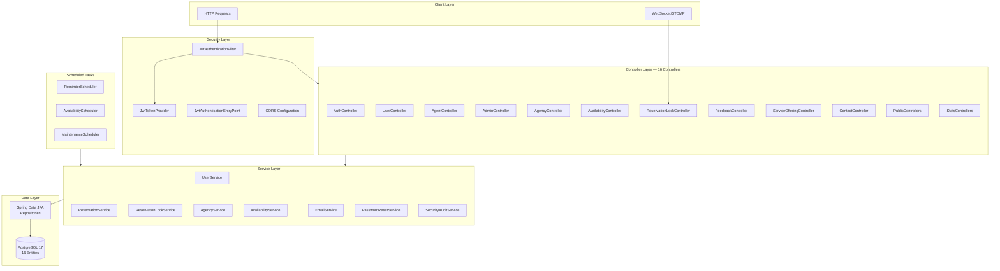
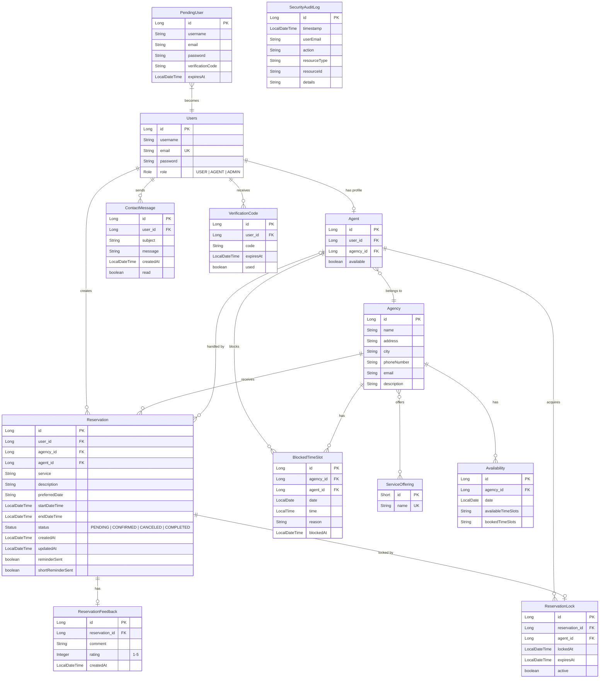
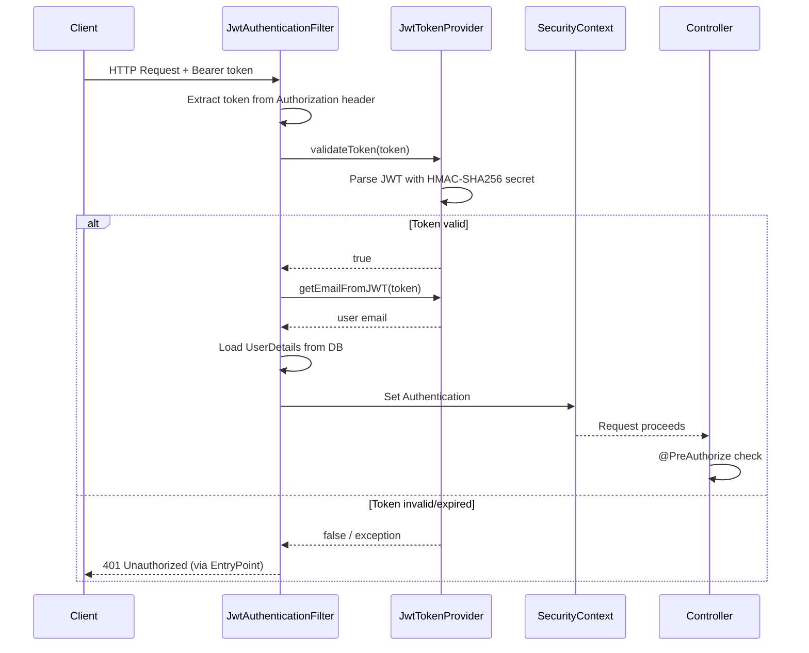

<div align="center">

# AgencyBooking — Backend API

**Spring Boot 3.4.2 REST API with JWT security, WebSocket real-time locking, and scheduled automation**


</div>

---

## Overview

The backend is a Spring Boot REST API that powers the AgencyBooking platform. It provides JWT-based authentication with three roles (USER, AGENT, ADMIN), real-time reservation locking via WebSocket/STOMP, scheduled tasks for reminders and maintenance, and email notifications for the complete reservation lifecycle.

---

## Tech Stack

| Technology | Version | Purpose |
|-----------|---------|---------|
| Spring Boot | 3.4.2 | Application framework |
| Java | 21 | Language |
| Spring Security | — | Authentication & authorization |
| Spring Data JPA | — | Database ORM |
| Spring WebSocket | — | STOMP real-time messaging |
| Spring Mail | — | SMTP email notifications |
| Spring Validation | — | Request validation |
| PostgreSQL | 17 | Relational database |
| jjwt | 0.11.5 | JWT token generation & validation |
| SpringDoc OpenAPI | 2.3.0 | Swagger API documentation |
| Lombok | — | Boilerplate reduction |
| Maven Wrapper | 3.9.9 | Build tool |
| Docker | — | Containerization |

---

## Architecture



---

## Project Structure

```
src/main/java/com/project/agent/
├── configuration/
│   ├── JpaAuditingConfig.java        # Enables @CreatedDate, @LastModifiedDate
│   ├── LoggingConfiguration.java      # Logging setup
│   ├── OpenApiConfig.java             # Swagger/OpenAPI configuration
│   ├── PasswordEncoderConfig.java     # BCrypt password encoder bean
│   ├── RequestLoggingFilter.java      # HTTP request logging
│   ├── SchedulingConfiguration.java   # Enables @Scheduled tasks
│   ├── WebSocketConfig.java           # STOMP WebSocket broker config
│   └── WebSocketEventListener.java    # WebSocket connection events
│
├── controller/
│   ├── AdminContactController.java    # Admin contact message management
│   ├── AdminController.java           # User/agent CRUD, role management
│   ├── AdminProfileController.java    # Admin profile settings
│   ├── AgencyController.java          # Agency CRUD, agent assignment
│   ├── AgentController.java           # Reservation management for agents
│   ├── AuthController.java            # Login, register, password reset
│   ├── AvailabilityController.java    # Time slot availability
│   ├── ContactController.java         # User contact messages
│   ├── PublicFeedbackController.java  # Public testimonials & stats
│   ├── PublicStatsController.java     # Public platform statistics
│   ├── ReservationFeedbackController.java # Feedback CRUD
│   ├── ReservationLockController.java # Real-time reservation locking
│   ├── ServiceOfferingController.java # Service CRUD
│   ├── SystemMonitoringController.java # Scheduled task monitoring
│   ├── SystemStatsController.java     # Admin system statistics
│   ├── TimeSlotManagementController.java # Block/unblock time slots
│   └── UserController.java            # User profile & reservations
│
├── dto/                               # Request/response data transfer objects
│   ├── LoginRequest, RegisterRequest
│   ├── JwtAuthResponse, ApiResponse
│   ├── ReservationRequest, LockStatusDTO
│   ├── AgentStatsDTO, UserStatsDTO
│   └── ... (20+ DTOs)
│
├── exception/
│   ├── BadRequestException.java       # 400 errors
│   ├── ConflictException.java         # 409 errors
│   ├── GlobalExceptionHandler.java    # @RestControllerAdvice
│   ├── ResourceNotFoundException.java # 404 errors
│   └── UnauthorizedException.java     # 401 errors
│
├── model/                             # JPA entities
│   ├── Users.java                     # User entity (implements UserDetails)
│   ├── Agent.java                     # Agent entity
│   ├── Agency.java                    # Agency with business hours
│   ├── Reservation.java              # Reservation with status lifecycle
│   ├── ReservationLock.java          # Optimistic lock entity
│   ├── ReservationFeedback.java      # Rating & comment
│   ├── Availability.java            # Time slot availability
│   ├── BlockedTimeSlot.java          # Agent-blocked slots
│   ├── ServiceOffering.java          # Service catalog
│   ├── ContactMessage.java           # Support messages
│   ├── PendingUser.java              # Pre-verification registrations
│   ├── VerificationCode.java         # Email verification codes
│   └── SecurityAuditLog.java         # Audit trail
│
├── repository/                        # Spring Data JPA repositories
│   ├── UserRepository.java
│   ├── AgentRepository.java
│   ├── AgencyRepository.java
│   ├── ReservationRepository.java
│   ├── ReservationLockRepository.java
│   ├── ReservationFeedbackRepository.java
│   ├── AvailabilityRepository.java
│   ├── BlockedTimeSlotRepository.java
│   ├── ServiceOfferingRepository.java
│   ├── ContactMessageRepository.java
│   ├── PendingUserRepository.java
│   ├── VerificationCodeRepository.java
│   └── SecurityAuditLogRepository.java
│
├── scheduler/
│   ├── AppointmentReminderScheduler.java # Imminent appointment notifications
│   ├── AvailabilityScheduler.java        # Slot generation & archiving
│   ├── MaintenanceScheduler.java         # Lock cleanup & metrics
│   └── ReminderScheduler.java            # Email reminders & pending cleanup
│
├── security/
│   ├── JwtAuthenticationEntryPoint.java  # 401 response handler
│   ├── JwtAuthenticationFilter.java      # Extract & validate JWT per request
│   ├── JwtTokenProvider.java             # Token generation & validation
│   └── SecurityConfig.java              # Filter chain, CORS, route security
│
└── service/
    ├── AgencyService.java
    ├── AgentStatsService.java
    ├── AuthorizationService.java
    ├── AvailabilityService.java
    ├── ContactService.java
    ├── EmailService.java
    ├── PasswordResetService.java
    ├── ReservationFeedbackService.java
    ├── ReservationLockService.java
    ├── ReservationService.java
    ├── SecurityAuditService.java
    ├── ServiceOfferingService.java
    ├── SystemStatsService.java
    ├── UserService.java
    └── UserStatsService.java
```

---

## Data Model



---

## API Reference

### Authentication — `/auth`

| Method | Path | Auth | Description |
|--------|------|------|-------------|
| POST | `/login` | Public | Authenticate and receive JWT tokens |
| POST | `/register` | Public | Initiate registration (sends verification email) |
| POST | `/verify-email` | Public | Complete registration with verification code |
| POST | `/refresh` | Public | Refresh expired access token |
| POST | `/logout` | Auth | Invalidate session |
| GET | `/check-auth` | Auth | Verify authentication status |
| POST | `/password-reset/request` | Public | Request password reset email |
| POST | `/password-reset/verify-code` | Public | Verify reset code |
| POST | `/password-reset/new-password` | Public | Set new password |

### Agencies — `/api/agencies`

| Method | Path | Auth | Description |
|--------|------|------|-------------|
| GET | `/` | Public | List all agencies |
| GET | `/{id}` | Public | Get agency details |
| GET | `/public` | Public | Get public agency listing |
| GET | `/public/by-city/{city}` | Public | Filter agencies by city |
| POST | `/` | ADMIN | Create agency |
| PUT | `/{id}` | ADMIN | Update agency |
| DELETE | `/{id}` | ADMIN | Delete agency |
| POST | `/{agencyId}/assign-agent/{agentId}` | ADMIN | Assign agent to agency |
| POST | `/remove-agent/{agentId}` | ADMIN | Remove agent from agency |
| GET | `/{agencyId}/agents` | Auth | Get agency's agents |

### Availability — `/api/availability`

| Method | Path | Auth | Description |
|--------|------|------|-------------|
| GET | `/{agencyId}` | Public | Get agency availability |
| GET | `/{agencyId}/week` | Public | Get weekly availability |
| GET | `/{agencyId}/check` | Public | Check specific time slot |
| POST | `/{agencyId}/reserve-temp` | Auth | Temporarily reserve a slot |
| POST | `/{agencyId}/release-temp` | Auth | Release temporary reservation |

### User — `/api/user`

| Method | Path | Auth | Description |
|--------|------|------|-------------|
| GET | `/profile` | USER+ | Get current user profile |
| PUT | `/profile` | USER+ | Update profile |
| POST | `/update-username` | USER+ | Change username |
| POST | `/change-password` | USER+ | Change password |
| DELETE | `/account` | USER+ | Delete account |
| GET | `/reservations` | USER+ | Get user's reservations |

### Agent — `/api/agent`

| Method | Path | Auth | Description |
|--------|------|------|-------------|
| GET | `/info` | AGENT | Get current agent info |
| GET | `/stats` | AGENT | Get agent statistics |
| PUT | `/toggle-availability` | AGENT | Toggle availability status |
| GET | `/reservations/pending` | AGENT | List pending reservations |
| GET | `/reservations/confirmed` | AGENT | List confirmed reservations |
| GET | `/reservations/completed` | AGENT | List completed reservations |
| GET | `/reservations/canceled` | AGENT | List canceled reservations |
| POST | `/reservation/confirm/{id}` | AGENT | Confirm reservation (set date/time) |
| POST | `/reservation/cancel/{id}` | AGENT | Cancel reservation (with reason) |
| POST | `/reservation/complete/{id}` | AGENT | Complete reservation (with notes) |

### Reservation Locking — `/api/agent/lock`

| Method | Path | Auth | Description |
|--------|------|------|-------------|
| POST | `/acquire/{reservationId}` | AGENT | Acquire 5-minute lock |
| POST | `/release/{reservationId}` | AGENT | Release lock |
| POST | `/extend/{reservationId}` | AGENT | Extend lock by 5 minutes |
| POST | `/force-release/{reservationId}` | ADMIN | Force release any lock |

### Time Slots — `/api/timeslots`

| Method | Path | Auth | Description |
|--------|------|------|-------------|
| POST | `/block` | AGENT/ADMIN | Block a time slot |
| POST | `/unblock/{id}` | AGENT/ADMIN | Unblock a time slot |
| POST | `/unblock` | AGENT/ADMIN | Unblock multiple slots |

### Feedback — `/api/feedback`

| Method | Path | Auth | Description |
|--------|------|------|-------------|
| POST | `/` | USER+ | Submit feedback for completed reservation |
| GET | `/{reservationId}` | USER+ | Get feedback for reservation |
| GET | `/{reservationId}/exists` | USER+ | Check if feedback exists |
| GET | `/` | USER+ | Get all user feedbacks |

### Services — `/api/services`

| Method | Path | Auth | Description |
|--------|------|------|-------------|
| GET | `/` | Public | List all services |
| GET | `/{id}` | Public | Get service details |
| POST | `/` | ADMIN | Create service |
| PUT | `/{id}` | ADMIN | Update service |
| DELETE | `/{id}` | ADMIN | Delete service |
| POST | `/{serviceId}/assign-agency/{agencyId}` | ADMIN | Link service to agency |
| POST | `/{serviceId}/remove-agency/{agencyId}` | ADMIN | Unlink service from agency |
| GET | `/{serviceId}/agencies` | Public | Get agencies offering service |

### Contact — `/api/contact`

| Method | Path | Auth | Description |
|--------|------|------|-------------|
| POST | `/` | USER+ | Submit contact message |
| GET | `/` | USER+ | Get user's messages |

### Admin — `/api/admin`

| Method | Path | Auth | Description |
|--------|------|------|-------------|
| GET | `/users` | ADMIN | List all users |
| POST | `/users/change-role/{id}` | ADMIN | Change user role |
| POST | `/users/create-agent` | ADMIN | Create new agent account |
| POST | `/users/convert-to-agent/{userId}` | ADMIN | Convert user to agent |
| GET | `/agents` | ADMIN | List all agents |
| PUT | `/agents/{id}/assign-agency` | ADMIN | Assign agency to agent |
| PUT | `/agents/{id}/toggle-availability` | ADMIN | Toggle agent availability |
| DELETE | `/users/{id}` | ADMIN | Delete user |
| DELETE | `/agents/{id}` | ADMIN | Delete agent |

### Admin Contact — `/api/admin/contact`

| Method | Path | Auth | Description |
|--------|------|------|-------------|
| GET | `/` | ADMIN | List all contact messages |
| GET | `/unread` | ADMIN | Get unread messages |
| POST | `/{id}/read` | ADMIN | Mark message as read |
| DELETE | `/{id}` | ADMIN | Delete message |

### Admin Profile — `/api/admin/profile`

| Method | Path | Auth | Description |
|--------|------|------|-------------|
| GET | `/` | ADMIN | Get admin profile |
| POST | `/update-username` | ADMIN | Update username |
| POST | `/change-password` | ADMIN | Change password |

### Admin Stats — `/api/admin/stats`

| Method | Path | Auth | Description |
|--------|------|------|-------------|
| GET | `/sessions` | ADMIN | Session statistics |
| GET | `/general` | ADMIN | General platform statistics |
| GET | `/session-graph` | ADMIN | Session graph data |

### Admin Monitoring — `/api/admin/monitoring`

| Method | Path | Auth | Description |
|--------|------|------|-------------|
| GET | `/scheduled-tasks` | ADMIN | Scheduled task health status |

### Public — `/api/public`

| Method | Path | Auth | Description |
|--------|------|------|-------------|
| GET | `/stats` | Public | Platform statistics |
| GET | `/feedback/statistics` | Public | Feedback statistics |
| GET | `/feedback/comments` | Public | Recent feedback comments |
| GET | `/feedback/testimonials` | Public | Featured testimonials |

### User Stats — `/api/user/stats`

| Method | Path | Auth | Description |
|--------|------|------|-------------|
| GET | `/` | USER+ | Current user statistics |

---

## Authentication & Security



### JWT Configuration

| Parameter | Value |
|-----------|-------|
| Algorithm | HMAC-SHA256 |
| Access token TTL | 24 hours (86,400,000 ms) |
| Refresh token TTL | 7 days (604,800,000 ms) |
| Secret | Configurable via `JWT_SECRET` env var |

### Role Hierarchy

| Role | Access |
|------|--------|
| `ROLE_USER` | Own reservations, feedback, profile, contact |
| `ROLE_AGENT` | Agency reservations, lock system, calendar, time slots |
| `ROLE_ADMIN` | Full platform management + all USER/AGENT permissions |

### Security Filter Chain

```
Public:     POST /auth/**, GET /api/public/**, GET /api/agencies/**,
            GET /api/services/**, GET /api/availability/**,
            GET /websocket/**, GET /swagger-ui/**

AGENT+:     POST /api/agent/**, POST /api/timeslots/**
ADMIN:      POST /api/admin/**
USER+:      GET /api/user/**
Default:    Authenticated required
```

---

## WebSocket Topics

| Destination | Type | Direction | Purpose |
|-------------|------|-----------|---------|
| `/websocket` | Endpoint | Client → Server | Primary WebSocket connection |
| `/reservation-websocket` | Endpoint | Client → Server | Reservation-specific connection |
| `/topic/reservation-lock-status` | Broadcast | Server → All | Global lock status changes |
| `/topic/lock-status/{reservationId}` | Topic | Server → Subscribers | Per-reservation lock updates |
| `/app/check-lock/{reservationId}` | Message | Client → Server | Request lock status check |

**Configuration:**
- SockJS fallback enabled
- Simple broker: `/topic`, `/queue`
- App prefix: `/app`
- User prefix: `/user`
- Heartbeat: 10,000ms

---

## Reservation Locking System

The locking system prevents multiple agents from modifying the same reservation simultaneously.

### How It Works

1. **Acquire Lock** — Agent calls `POST /api/agent/lock/acquire/{id}`. Creates a `ReservationLock` record valid for 5 minutes and caches it in a `ConcurrentHashMap`.

2. **WebSocket Broadcast** — Lock status is broadcast to:
   - `/topic/reservation-lock-status` (all agents see the lock)
   - `/topic/lock-status/{reservationId}` (subscribers of that reservation)

3. **Lock Enforcement** — Before confirming/canceling/completing a reservation, the system verifies the current agent holds the active lock.

4. **Extend** — Agent can extend the lock by 5 more minutes via `POST /api/agent/lock/extend/{id}`.

5. **Release** — Agent releases the lock when done, or it expires automatically.

6. **Cleanup** — Scheduled tasks run every 60 seconds to deactivate expired locks and every 5 minutes to sync the in-memory cache with the database.

7. **Force Release** — Admins can force-release any lock via `POST /api/agent/lock/force-release/{id}`.

### Lock Status Payload

```json
{
  "reservationId": 42,
  "locked": true,
  "agentId": 7,
  "agentName": "John Doe",
  "agentEmail": "john@agency.com",
  "lockMessage": "Reservation locked by John Doe"
}
```

---

## Scheduled Tasks

| Task | Schedule | Purpose |
|------|----------|---------|
| `cleanupExpiredLocks` | Every 60s | Deactivate expired reservation locks |
| `cleanupLockCache` | Every 5min | Sync in-memory lock cache with database |
| `checkPassedTimeSlots` | Every 60s | Remove past time slots from availability |
| `generateFutureAvailabilities` | Daily 00:00 | Pre-generate availability for upcoming days |
| `archiveOldAvailabilities` | Sunday 01:00 | Clean up past availability records |
| `sendAppointmentReminders` | Hourly | Email reminders for upcoming appointments |
| `sendShortReminders` | Every 15min | Short-notice reminders for imminent appointments |
| `cancelExpiredPendingReservations` | Daily 02:00 | Auto-cancel old pending reservations |
| `notifyUpcomingAppointments` | Every 15min | Notify agents of imminent appointments |
| `cleanupExpiredLocks (maintenance)` | Every 10min | Secondary lock cleanup |
| `calculateSystemMetrics` | Hourly | Compute and cache system statistics |

All schedules are configurable via `application.properties`.

---

## Email Notifications

The `EmailService` sends HTML emails via SMTP for:

| Event | Recipient | Content |
|-------|-----------|---------|
| Registration verification | New user | 6-digit verification code |
| Password reset | User | Reset verification code |
| Reservation confirmed | User | Confirmation details with date/time |
| Reservation canceled | User | Cancellation with reason |
| Reservation completed | User | Completion notes |
| Appointment reminder | User | Upcoming appointment details |
| Feedback thank you | User | Thank you after rating submission |
| Contact message | Admin | New support message notification |

**SMTP Configuration:**

```properties
spring.mail.host=smtp.gmail.com
spring.mail.port=587
spring.mail.username=${MAIL_USERNAME}
spring.mail.password=${MAIL_PASSWORD}
spring.mail.properties.mail.smtp.auth=true
spring.mail.properties.mail.smtp.starttls.enable=true
```

---

## Exception Handling

All errors return a consistent `ApiResponse` format:

```json
{
  "message": "Error description",
  "success": false
}
```

| Exception | HTTP Status | When |
|-----------|-------------|------|
| `ResourceNotFoundException` | 404 | Entity not found by ID |
| `BadRequestException` | 400 | Invalid request data |
| `UnauthorizedException` | 401 | Authentication failure |
| `ConflictException` | 409 | Duplicate resource / state conflict |
| `BadCredentialsException` | 401 | Wrong email or password |
| `AccessDeniedException` | 403 | Insufficient role permissions |
| `MethodArgumentNotValidException` | 400 | Bean validation failure |
| `RuntimeException` | 500 | Unexpected server error |

---

## Installation & Development

### Prerequisites

- Java JDK 21
- Docker & Docker Compose
- Maven 3.9+ (or use included wrapper)

### 1. Start Database

```bash
docker compose up db -d
```

This starts PostgreSQL 17 on port 5432 with database `Project`.

### 2. Configure Environment

```bash
export JWT_SECRET="your-64-char-hex-secret-key"
export MAIL_PASSWORD="your-smtp-app-password"
export CORS_ALLOWED_ORIGINS="http://localhost:4200"
export FRONTEND_URL="http://localhost:4200"
```

### 3. Build & Run

```bash
./mvnw clean compile
./mvnw spring-boot:run
```

The API starts on **http://localhost:8082**.

### 4. Verify

- API Health: http://localhost:8082/auth/check-auth
- Swagger UI: http://localhost:8082/swagger-ui.html
- OpenAPI Spec: http://localhost:8082/v3/api-docs

---

## Configuration

### `application.properties`

| Property | Default | Description |
|----------|---------|-------------|
| `server.port` | `8082` | Server port |
| `spring.datasource.url` | `jdbc:postgresql://localhost:5432/Project` | Database URL |
| `spring.datasource.username` | `postgres` | Database user |
| `spring.datasource.password` | — | Database password |
| `spring.jpa.hibernate.ddl-auto` | `update` | Schema auto-update |
| `app.jwt.secret` | `${JWT_SECRET}` | JWT signing key |
| `app.jwt.expiration` | `86400000` | Access token TTL (ms) |
| `app.jwt.refresh.expiration` | `604800000` | Refresh token TTL (ms) |
| `app.cors.allowed-origins` | `${CORS_ALLOWED_ORIGINS}` | CORS origins |
| `app.frontend-url` | `${FRONTEND_URL}` | Frontend URL for emails |
| `spring.mail.host` | `smtp.gmail.com` | SMTP host |
| `spring.mail.port` | `587` | SMTP port |
| `spring.mail.username` | — | SMTP username |
| `spring.mail.password` | `${MAIL_PASSWORD}` | SMTP password |

### Scheduler Configuration

| Property | Default | Description |
|----------|---------|-------------|
| `scheduler.availability-check.interval-ms` | `60000` | Slot check interval |
| `scheduler.expired-locks-cleanup.interval-ms` | `600000` | Lock cleanup interval |
| `scheduler.future-availability-generation.cron` | `0 0 0 * * *` | Availability generation |
| `scheduler.old-availability-archiving.cron` | `0 0 1 * * SUN` | Old data archiving |
| `scheduler.abandoned-reservations-cleanup.cron` | `0 0 2 * * *` | Pending reservation cleanup |
| `scheduler.appointment-reminders.cron` | `0 0 * * * *` | Reminder emails |
| `scheduler.system-metrics.cron` | `0 0 * * * *` | Metrics calculation |

---

## Docker Deployment

### Dockerfile (Multi-stage)

```dockerfile
# Stage 1: Build with Maven
FROM maven:3.9.9-eclipse-temurin-21-alpine AS builder
# Copies pom.xml, src, mvnw → runs ./mvnw package -DskipTests

# Stage 2: Runtime
FROM eclipse-temurin:21-jre-alpine
# Copies JAR from builder → runs with spring.profiles.active=docker
EXPOSE 8082
```

### Docker Compose

```bash
# Full stack (API + Database)
docker compose up --build

# Database only
docker compose up db -d
```

Services:
- **app** — Spring Boot API on port 8082
- **db** — PostgreSQL 17 on port 5432, persistent volume `db-data`

---

## API Documentation

Interactive Swagger UI is available at:

```
http://localhost:8082/swagger-ui.html
```

OpenAPI 3.0 JSON spec:

```
http://localhost:8082/v3/api-docs
```

The API is titled **"AgencyBooking API"** v1.0, with Bearer JWT security scheme configured for all authenticated endpoints.

---

## Related

- [Root README](../README.md) — Full project overview & installation guide
- [Frontend README](../agency-booking-frontend/README.md) — Angular app documentation
